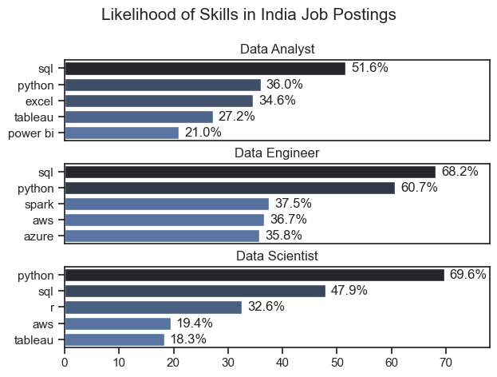

# Overview
Welcome to my analysis of the data job market, focusing on data analyst roles. This project was created to navigate and understand the Indian data job market more effectively. It delves into the top-paying and in-demand skills to help find optimal job opportunities for data analysts.

Through a series of Python scripts, I explore key questions such as the most demanded skills, salary trends, and the intersection of demand and salary in data analytics.

# The Qustions
Below are the questions I want to answer in my project:

1. What are the skills most in demand for the top 3 most popular data roles?
2. How are in-demand skills trending for Data Analysts?
3. How well do jobs and skills pay for Data Analysts?
4. What are the optimal skills for data analysts to learn? (High Demand AND High Paying)

# Tools I Used for Market Analysis

For my deep dive into the data analyst job market, I used several key tools:

- **Python**: The backbone of my analysis. It helped me work with data and uncover important insights.  
  - **Pandas Library**: Used for data analysis and manipulation.  
  - **Matplotlib Library**: Used to create visualizations.  
  - **Seaborn Library**: Helped in building more advanced and cleaner visuals.  

- **Jupyter Notebooks**: Used to run Python code while keeping notes and analysis in one place.  

- **Visual Studio Code**: My primary editor for writing and executing Python scripts.  

- **Git & GitHub**: Used for version control, code sharing, and tracking changes across the project.

# Data Preparation and Cleanup

This section outlines the steps taken to prepare the data for analysis, ensuring accuracy and usability.

## Import & Clean Up Data

I start by importing necessary libraries and loading the dataset, followed by initial data cleaning tasks to ensure data quality.

```python
# Importing Libraries
import ast
import pandas as pd
import seaborn as sns
from datasets import load_dataset
import matplotlib.pyplot as plt  

# Loading Data
dataset = load_dataset('lukebarousse/data_jobs')
df = dataset['train'].to_pandas()

# Data Cleanup
df['job_posted_date'] = pd.to_datetime(df['job_posted_date'])
df['job_skills'] = df['job_skills'].apply(lambda x: ast.literal_eval(x) if pd.notna(x) else x)
```

## Filter India Jobs

To focus my analysis on the India job market, I apply filters to the dataset, narrowing down to roles based in the United States.

```python
df_IN = df[df['job_country'] == 'India']
```

# The Analysis
## 1. What are the most demand skills for the top 3 most popular data roles?
To find the most demanded top 5 skills in top 3 data roles. I filter out by the demand of those skills in that particular role. This query highlights the most popular job titles and their associate top skills, showing which skills to focus on depending on the role you are targeting. 

View my notebook with detail steps here: [2_Skills_Count](3_Project\2_Skills_Count.ipynb)

### Visualize Data
```python
fig, ax = plt.subplots(len(job_titles), 1)

sns.set_theme(style='ticks')

for i, job_title in enumerate(job_titles):
    df_plot = df_skills_perc[df_skills_perc['job_title_short'] == job_title].head(5)
    
    sns.barplot(data=df_plot, x='skill_percent', y='job_skills', ax=ax[i], hue='skill_count', palette='dark:b_r')

plt.show()
```
### Results




### Insights

- SQL and Python dominates in all three roles securing the first two position in all three roles. SQL demands goes as high as 68.2% for Data Engineers and Python demands goes as high as 69.6% for Data Scientist. If you are starting out consider this two skills as your entry ticket.
- Specialization can make you standout. Data Engineers lean toward cloud and big data tools (AWS, Spark) while Analysts and Scientist rely more on visualization and statistical tools like Tableau and Excel.
- Visualization and reporting tools are more role-specific, with Tableau at 27.2% and PowerBI at 21.0%for Analysts but only 18.3% for Scientists, showing that storytelling matters more in analysis than pure modeling.

## 2. How are in-demand skills trending for Data Analysts?
To find how the skills were trending in 2023 for Data Analysts, I filtered the data analyst position and group them by skill by the month of the job posting. This has help me to map the  top 5 skills for Data Analyst each month, helping to find the popular skills throughout 2023.

View my notebook with detail steps here: [3_Skills_Count](3_Project\3_Skills_Trend.ipynb)

### Visualize Data
```python
from matplotlib.ticker import PercentFormatter

df_plot = df_DA_IN_percent.iloc[:, :5]
sns.lineplot(data=df_plot, dashes=False, palette='tab10')

ax = plt.gca()
ax.yaxis.set_major_formatter(PercentFormatter(decimals=0))

plt.show()
```

### Results


*Bar graph visualizing the trending top skills for data analysts in the India in 2023*

### Insights

- SQL demand stays consistently high throughout the year, peaking near 62% in March and rarely dropping below 45%. It remains the top, stable skill, making it a safe long-term bet.
- Python and Excel vary closely between 30%–42%, often crossing each other. This shows employers treat them as strong, complementary skills that make your profile more flexible.
- Tableau and Power BI remain the top two BI tools, with demand fluctuating in the range of ~19%–34% and ~16%–23%, respectively. These tools can quietly boost your profile and tip hiring decisions in your favor.

## 3. How well do jobs and skills pay for Data Analyst?
To identify the highest paying roles and skills, I only consider jobs in India and looked at their median salary. But first I looked at the salary distributions of common data jobs like Data Scientist, Data Engineer, and Data Analyst, to get an idea of which jobs are paid the most.

View my notebook with detailed steps here: [4_Salary_Analysis](3_Project\4_Salary_Analysis.ipynb)

### Visualize Data

```python
sns.boxplot(data=df_IN_top6, x='salary_year_avg', y='job_title_short', order=job_order)

ticks_x = plt.FuncFormatter(lambda y, pos: f'₹{int(y/100000)}K')
plt.gca().xaxis.set_major_formatter(ticks_x)
plt.show()
```

### Results


*Box plot visualizing the salary distributions for the top 6 data job titles*

### Insights

- Machine Learning Engineers and Data Scientists sit at the top, with salaries stretching close to ₹200L and ₹180L. The range is wide, which means higher risk but also much higher reward.
- Data Engineers show strong, stable earnings, mostly between ₹70L–₹130L, with fewer extreme outliers. It’s like a steady engine less flashy than ML, but reliable and consistently high-paying.
- Data Analysts and Software Engineers cluster lower, mostly around ₹40L–₹90L, with occasional spikes. Growth exists, but without specialization, salaries tend to hit a ceiling sooner than expected.

## Highest Paid & Most Demanded Skills for Data Analysts

Next, I narrowed my analysis and focused only on data analyst roles. I looked at the highest-paid skills and the most in-demand skills. I used two bar charts to showcase these.

### Visualize Data
```python
fig, ax = plt.subplots(2, 1)  

# Top 10 Highest Paid Skills for Data Analysts
sns.barplot(data=df_DA_top_pay, x='median', y=df_DA_top_pay.index, hue='median', ax=ax[0], palette='dark:b_r')

# Top 10 Most In-Demand Skills for Data Analysts')
sns.barplot(data=df_DA_skills, x='median', y=df_DA_skills.index, hue='median', ax=ax[1], palette='light:b')

plt.show()
```

### Results
Here is the breakdown of the highest-paid & most in-demand skills for data analysts in India


*Two seperate horizontal bar graphs visualizing the highest-paid skills and most in-demand skills for Data Analyst in India*

### Insights

- The highest-paying skills like PySpark, Linux, and GitLab all cluster around ₹135L–₹140L, yet they don't appear in top demanding list. It implies that high pay often hides in niche, less crowded skills.
- In-demand skills like Spark (~₹90L), Power BI (~₹90L), and Tableau (~₹85L) offer solid but lower salaries, showing a clear trade-off: popularity brings volume, but not always premium pay.
- Python and SQL sit in the middle, with demand high and salaries around ₹75L–₹80L. They act like a bridge, common enough to enter the field, but not enough alone to reach top pay.

## 4. What are the most optimal skills to learn for Data Analysts?

To identify the most optimal skills to learn ( the ones that are the highest paid and highest in demand) I calculated the percent of skill demand and the median salary of these skills. To easily identify which are the most optimal skills to learn.

View my notebook with detailed steps here: [5_Optimal_Skills](3_Project\5_Optimal_Skills.ipynb)

### Visualize Data

```python
from adjustText import adjust_text
import matplotlib.pyplot as plt

plt.scatter(df_DA_skills_high_demand['skill_percent'], df_DA_skills_high_demand['median_salary'])

plt.show()
```

### Results


*A scatter plot visualizing the most optimal skills (high paying & high demand) for data analyst in India*

### Insights

- SQL shows the highest presence at about 49% with a median salary near ₹79L. It leads in demand while staying in the mid-salary band rather than the top.
- Power BI, Spark, and Looker sit near the highest salaries around ₹90L–₹92L, yet their demand stays between roughly 10% and 20%, showing a clear gap between pay and market presence.
- Python and Excel cluster close together at about 40%–43% demand with salaries near ₹79L–₹81L, forming a tight middle group where both demand and pay remain closely aligned.

## Visualizing Different Technologies

Let's visualize the different technologies as well in the graph. We'll add color labels based on the technology (e.g., {Programming: Python})

### Visualize Data

```python
from matplotlib.ticker import PercentFormatter

# Create a scatter plot
sns.scatterplot(
    data=df_plot,
    x='skill_percent',
    y='median_salary',
    hue='technology'
)

plt.show()
```

### Results


### Insights

- Programming skills dominate demand, with SQL near 49% and Python around 40%, yet their salaries stay close to ₹79L–₹81L, placing them high in volume but not at the top in pay.
- Analyst tools cluster at higher salary levels, with Power BI, Tableau, and Looker around ₹88L–₹92L, while their demand stays between roughly 10% and 22%, showing a tighter, higher-paying segment.
- Cloud and database tools like AWS, Oracle, and Azure sit lower on both axes, with demand mostly below 20% and salaries between ₹65L–₹77L, forming the lowest concentration in this distribution.

# What I Learned

From this project, I deepended my understanding of the data analyst job market and enhanced my technical skills in Python. It has helped me in specially improving my data manipulation, and visualization skills. Here are the few things I learned:

- Advanced Python Usage: Utilizing libraries such as Pandas for data manipulation, Seaborn and Matplotlib for data visualization, and other libraries helped me perform complex data analysis tasks more efficiently.
- Data Cleaning Importance: I learned that thorough data cleaning and preparation are crucial before any analysis can be conducted, ensuring the accuracy of insights derived from the data.
- Strategic Skill Analysis: The project emphasized the importance of aligning one's skills with market demand. Understanding the relationship between skill demand, salary, and job availability allows for more strategic career planning in the tech industry.

# Insights

This project provide some core general insights into the data job market for analyst:

- **Skill Demand and Salary Correlation:** The link between demand and pay is not linear. Tools like SQL and Python appear most often but sit in moderate salary ranges, while skills like PySpark and Databricks command higher pay despite lower demand.
- **Market Trends:** Core tools such as SQL, Python, and Excel remain consistent across roles and over time. Alongside them, tools like Spark, AWS, and Tableau rise depending on the role, showing a clear shift based on specialization.
- **Economic Value of Skills:** Different tools carry different value types. SQL and Excel reflect stable, widely used skills, while PySpark, Linux, and Looker represent higher-value skills that are less common but associated with stronger earning potential. 

## Challenges I Faced

This project came with its own set of challenges, but each one added to the learning:

- **Data Inconsistencies**: Missing and uneven data made things tricky at times. Cleaning and standardizing the data became essential to keep the analysis reliable.

- **Complex Data Visualization**: Turning raw numbers into clear visuals was not always straightforward. Some datasets needed careful structuring to make the insights easy to understand.

- **Balancing Breadth and Depth**: Going deep into one area often meant losing sight of the bigger picture. Finding the right balance between detailed analysis and overall coverage took constant adjustment.

# Conclusion

This exploration into the data analyst job market has been incredibly informative, highlighting the critical skills and trends that shape this evolving field. The insights I got enhance my understanding and provide actionable guidance for anyone looking to advance their career in data analytics. As the market continues to change, ongoing analysis will be essential to stay ahead in data analytics. 